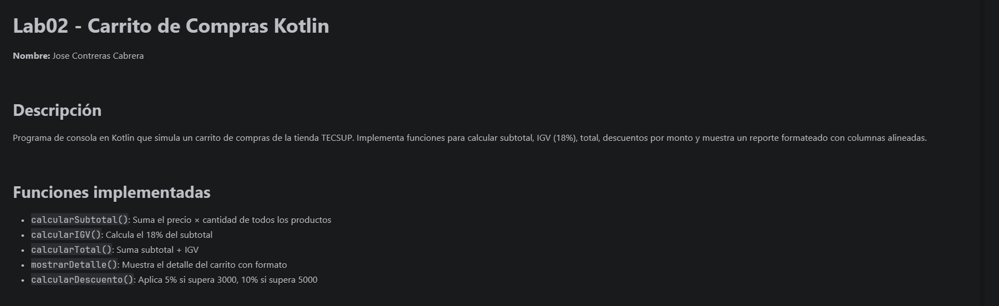

# Lab02 - Carrito de Compras Kotlin

**Nombre:** Jose Contreras Cabrera

## Descripción
Programa de consola en Kotlin que simula un carrito de compras de la tienda TECSUP.
Implementa funciones para calcular subtotal, IGV (18%), total, descuentos por monto
y muestra un reporte formateado con columnas alineadas.

## Funciones implementadas
- `calcularSubtotal()`: Suma el precio × cantidad de todos los productos
- `calcularIGV()`: Calcula el 18% del subtotal
- `calcularTotal()`: Suma subtotal + IGV
- `mostrarDetalle()`: Muestra el detalle del carrito con formato
- `calcularDescuento()`: Aplica 5% si supera 3000, 10% si supera 5000

## Captura de consola
!

## Respuesta: ¿Por qué nombre y precio son val pero cantidad es var?
- **`val` (nombre y precio):** Son inmutables porque el nombre y precio de un producto
  no deben cambiar una vez creado el objeto, manteniendo la integridad de los datos.
- **`var` (cantidad):** Es mutable porque el usuario puede modificar la cantidad de
  unidades que desea comprar en cualquier momento.
- **¿Qué pasa si intentas cambiar el precio?** Kotlin muestra error de compilación:
  *"Val cannot be reassigned"* (No se puede reasignar un valor inmutable).