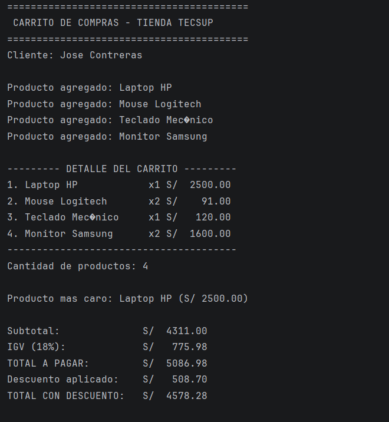

# Lab02 - Carrito de Compras en Kotlin

**Nombre:** Jose Contreras
**Cliente del sistema:** Jose Contreras

## Descripción
Programa de consola en Kotlin que simula un carrito de compras para la tienda TECSUP.
El sistema permite agregar productos, calcular el subtotal, el IGV (18%) y el total a pagar.
Además, implementa un reporte con columnas alineadas, identifica el producto más caro
y aplica descuentos automáticos según el monto total de la compra.

## Funciones implementadas
- `calcularSubtotal()`: Recorre la lista y suma el precio por cantidad de cada producto.
- `calcularIGV()`: Calcula el 18% del subtotal.
- `calcularTotal()`: Suma el subtotal y el IGV.
- `mostrarDetalle()`: Imprime el reporte del carrito con formato de columnas alineadas.
- `calcularDescuento()`: Aplica un 5% de descuento si el total supera 3000, 10% si supera 5000, o 0 en otro caso.

## Captura de la consola
!

## Análisis: ¿Por qué nombre y precio son `val` pero cantidad es `var`?
- **`val` (nombre y precio):** Se usan porque son propiedades inmutables. Una vez que el producto se crea, su identidad (nombre) y su valor base (precio) no deben cambiar para mantener la integridad de los datos.
- **`var` (cantidad):** Se usa porque es una propiedad mutable. El usuario debe poder modificar la cantidad de unidades que desea llevar en el carrito en cualquier momento.
- **¿Qué pasaría si intentas cambiar el precio?** Kotlin arrojaría un error de compilación indicando *"Val cannot be reassigned"* (No se puede reasignar un valor inmutable), ya que `val` no permite modificar su valor después de la inicialización.