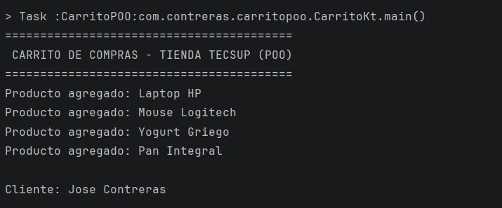
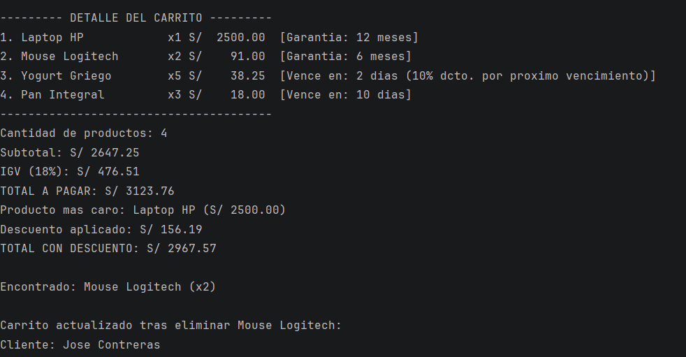
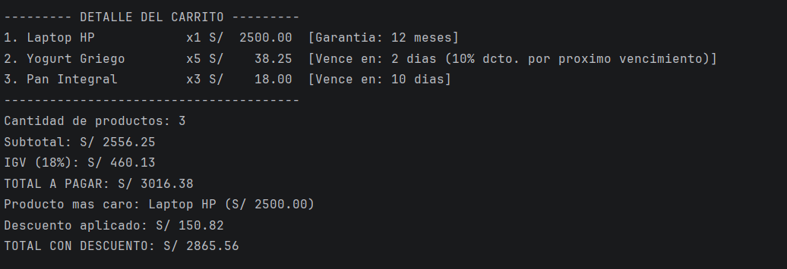

# Laboratorio 02 - Carrito de Compras en Kotlin (Version con IA - POO)

**Alumno:** José Contreras
**Curso:** Programación en Móviles
**Rama:** semana02-con-ia

## Prompt utilizado con IA

> "Ayúdame a convertir un carrito de compras en Kotlin a una versión que,
> implemente los 4 pilares de la Programación Orientada a Objetos::
> encapsulamiento, abstracción, herencia y polimorfismo, usando una clase
> abstracta Producto y al menos dos subclases con comportamiento distinto,
> más una clase Carrito que administre la lista de forma polimórfica.".

## Los 4 pilares de POO en este código

| Pilar | Dónde está aplicado |
|---|---|
| **Encapsulamiento** | `cantidad` en `Producto` es `protected`; `productos` y `cliente` en `Carrito` son `private`. Solo se accede mediante métodos públicos. |
| **Abstracción** | `Producto` es una clase `abstract` que define el contrato común (`calcularImporte`, `mostrarInfoAdicional`) sin implementar todos los detalles; `generarReporte()` oculta la complejidad de los cálculos al que la usa. |
| **Herencia** | `ProductoElectronico` y `ProductoPerecible` heredan de `Producto` (`: Producto(...)`), reutilizando sus propiedades y métodos comunes. |
| **Polimorfismo** | `Carrito` guarda una lista de tipo `Producto` (el tipo base), pero al llamar `calcularImporte()`, cada objeto ejecuta su propia versión: `ProductoPerecible` aplica un descuento automático si está por vencer, mientras `ProductoElectronico` usa el cálculo estándar. El mismo método, comportamiento distinto según el objeto real. |

## Estructura del código

- `Producto` (abstracta): nombre, precio, cantidad protegida, y dos métodos que las subclases personalizan.
- `ProductoElectronico`: agrega meses de garantía..
- `ProductoPerecible`: agrega días para vencer y aplica descuento automático si faltan 3 días o menos..
- `Carrito`: administra la lista de productos de forma polimórfica y concentra la lógica de subtotal, IGV, descuento y reporte.
- `main()`: crea productos de ambas subclases, genera el reporte, y demuestra búsqueda/eliminación..

## Diferencias frente a la versión sin IA

| Aspecto | Sin IA (funcional) | Con IA (POO completo) |
|---|---|---|
| Organización | Funciones sueltas + data class | Jerarquía de clases con herencia real |
| Encapsulamiento | Básico (val/var en data class) | Propiedades protegidas/privadas con métodos controlados |
| Polimorfismo | No aplica | calcularImporte() se comporta distinto por subclase |
| Reto adicional | Opcional | Integrado (buscarProducto, eliminarProducto) |
