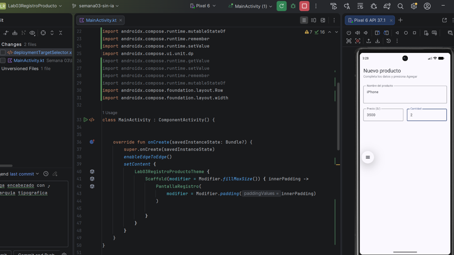
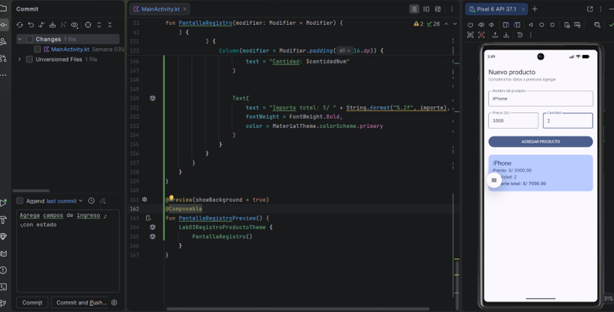

# Lab03RegistroProducto

**Autor:** Jose Abraham Contreras Cabrera

## Descripción

Aplicación móvil desarrollada en Android Studio con Jetpack Compose que permite registrar productos ingresando su nombre, precio y cantidad. La app calcula automáticamente el importe total (precio × cantidad) y muestra un resumen del producto registrado con un mensaje de confirmación.

## Funcionalidades

- Registro de productos con nombre, precio (S/) y cantidad
- Cálculo automático del importe total
- Visualización del resumen del producto en una tarjeta (Card)
- Mensaje de confirmación en color verde
- Validación de campos vacíos

## Capturas de Pantalla

### Pantalla inicial (formulario vacío)

![Pantalla inicial]

### Pantalla después de agregar un producto

![Pantalla con producto registrado]

## Estructura del Código

- `MainActivity.kt`: Activity principal que contiene la lógica de la interfaz
- `PantallaRegistro()`: Composable que maneja el formulario y la visualización
- Estados manejados con `mutableStateOf` y `remember`

## Tecnologías Utilizadas

- Kotlin
- Jetpack Compose
- Android Material Design 3

## ¿Qué pasaría si declaras las variables de los campos SIN remember?

Si se declararan las variables de los campos SIN `remember`, cada vez que ocurriera una recomposición (como al escribir en un campo de texto o al hacer clic en el botón), los valores de las variables se reiniciarían a su estado inicial. Esto provocaría que:

1. **Los campos de texto no conservarían lo que el usuario escribe:** Al escribir en un `OutlinedTextField`, el valor se actualizaría momentáneamente, pero al siguiente cambio de estado (como al presionar el botón), el valor volvería a ser el inicial (vacío).

2. **El resumen del producto no se mostraría correctamente:** Aunque se presione el botón "AGREGAR PRODUCTO", los valores de `nombre`, `precio` y `cantidad` estarían vacíos porque se habrían reiniciado.

3. **La interfaz no mantendría consistencia:** Al no preservar el estado entre recomposiciones, la UI no reflejaría correctamente los datos ingresados por el usuario, haciendo la aplicación no funcional.

En resumen, `remember` es esencial en Jetpack Compose para mantener el estado de las variables a través de las recomposiciones. Sin él, la aplicación perdería todos los datos ingresados por el usuario en cada actualización de la interfaz.