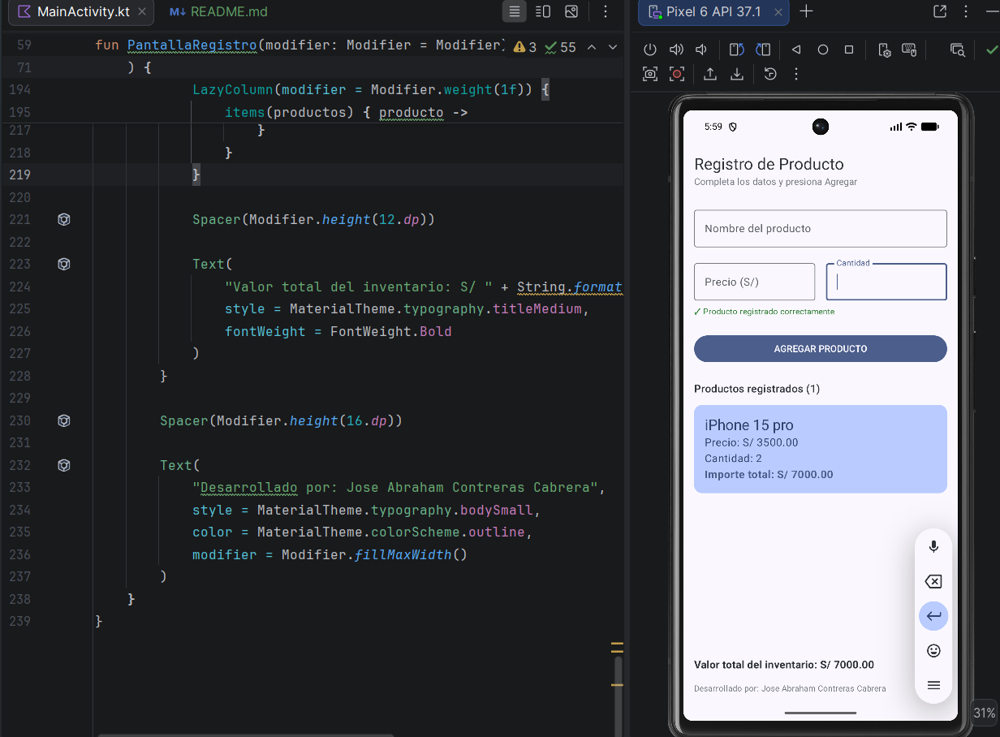

## Mejora con IA

### Tabla de Prompts y Decisiones

### Testeo del emulador con las imagenes desarrolladas: 

| Prompt que usé | Qué generó Gemini | Qué acepté o corregí (y por qué) |
|----------------|-------------------|----------------------------------|
| "Genera una app en Compose para registrar productos con nombre, precio y cantidad, que muestre una lista de productos agregados" | Código funcional con lista de productos, cálculos de importe y validaciones básicas. | Acepté la estructura general y la lógica de negocio. Corregí mensajes de error para que sean más específicos y agregué mensaje de éxito en verde para mejor experiencia de usuario. |
| "El código debe tener validaciones para campos vacíos" | Validaciones con mensaje genérico "El nombre no puede estar vacio". | Corregí separando cada validación (nombre, precio, cantidad) con mensajes claros y específicos. También agregué limpieza automática de mensajes al escribir en los campos. |
| "Muestra el total del inventario" | Generó un texto con el valor total sumando los importes. | Acepté completamente esta funcionalidad porque funcionaba correctamente. |
| "Diseño similar a las capturas de referencia" | Estructura básica con Card y colores primarios. | Agregué el footer "Desarrollado por", corregí títulos para que coincidan exactamente con las imágenes y mejoré los espaciados entre elementos. |