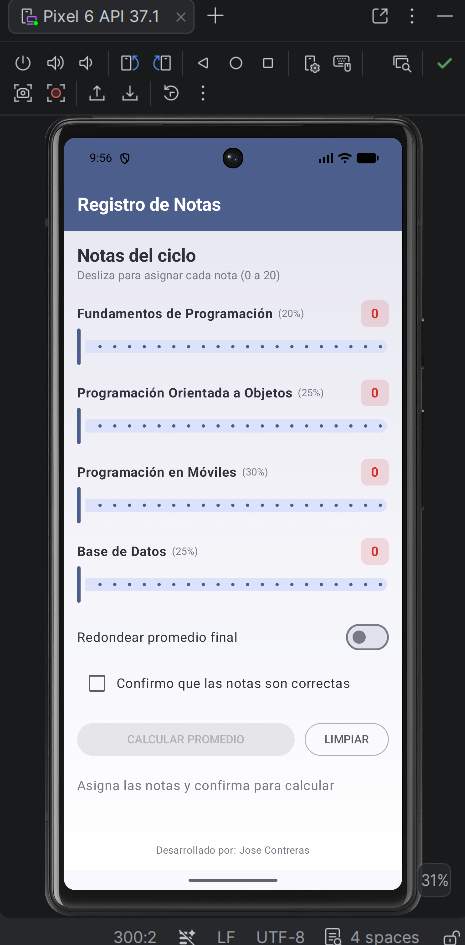
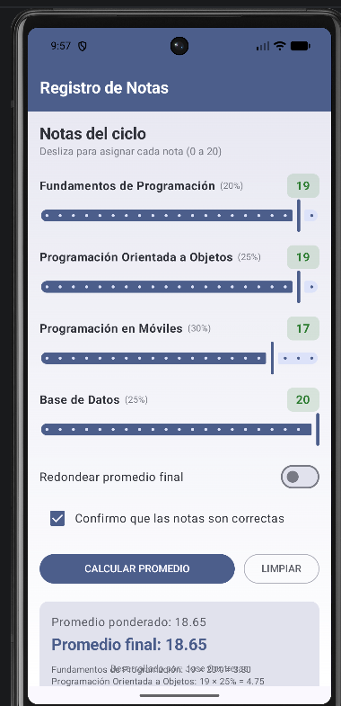

# Laboratorio 03 - Registro de Notas (Jetpack Compose)

**Alumno:** Jose Contreras
**Curso:** Programación en Móviles
**Rama:** tarea-semana03

## Descripción

Aplicación Android desarrollada con Jetpack Compose que calcula el promedio
ponderado de 4 cursos con pesos fijos (Fundamentos de Programación 20%,
Programación Orientada a Objetos 25%, Programación en Móviles 30%, Base de
Datos 25%). Introduce controles nuevos de Compose: `Slider`, `Switch` y
`Checkbox`, todos siguiendo el mismo patrón de estado (`value`/`onValueChange`
o `checked`/`onCheckedChange`) ya usado con `OutlinedTextField` en el
laboratorio anterior.

### Funcionalidades implementadas

- Barra superior "Registro de Notas" con color primario y fondo con degradado.
- 4 filas de curso, cada una con `Slider` (rango 0-20, valores enteros) y un
  badge que muestra la nota en vivo.
- `Switch` para redondear el promedio final al entero más cercano.
- `Checkbox` de confirmación que habilita/deshabilita el botón CALCULAR
  PROMEDIO (`enabled` del `Button`).
- Cálculo del promedio ponderado (2 decimales) y el promedio final
  (redondeado o no según el Switch).
- Observación automática (`EXCELENTE` / `APROBADO` / `EN RECUPERACIÓN` /
  `DESAPROBADO`) con `when`, mostrada en un chip de color según el rango.
- Mensaje de confirmación en verde y pie de página fijo abajo.

### Retos opcionales implementados

1. **Aporte por curso:** dentro de la tarjeta de resultados, se muestra una
   línea por curso con el cálculo `nota × peso% = aporte` (ej. "Programación
   en Móviles: 16 × 30% = 4.80").
2. **Slider con semáforo:** el badge de cada nota se pinta de rojo si la
   nota es menor a 13, y de verde si es 13 o más, usando un `if` como
   expresión para elegir el color.
3. **Botón LIMPIAR:** junto al botón principal, regresa las 4 notas a 0,
   apaga el Switch, desmarca el Checkbox y oculta la tarjeta de resultados.

## Verificación de casos de prueba

| Notas (F, POO, M, BD) | Redondear | Prom. ponderado | Prom. final | Observación |
|---|---|---|---|---|
| 15, 13, 16, 14 | ON | 14.55 | 15 | APROBADO |
| 12, 10, 11, 9 | OFF | 10.45 | 10.45 | EN RECUPERACIÓN |
| 18, 17, 19, 18 | ON | 18.05 | 18 | EXCELENTE |
| 8, 9, 7, 10 | OFF | 8.45 | 8.45 | DESAPROBADO |

Los 4 casos fueron verificados manualmente en la app y coinciden
exactamente con los valores esperados.

## Capturas

**Figura 1 - Estado inicial (notas en 0, botón deshabilitado):**

![Estado inicial]

**Figura 2 - Notas asignadas, confirmación marcada y promedio calculado:**

![Resultado calculado]